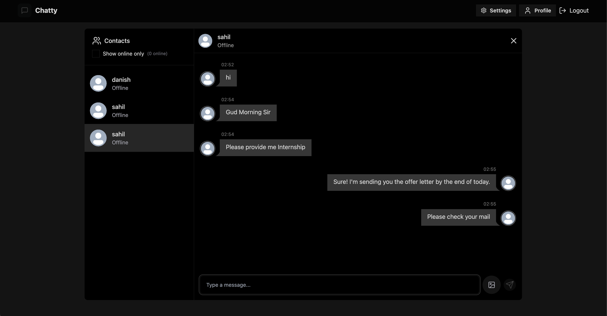
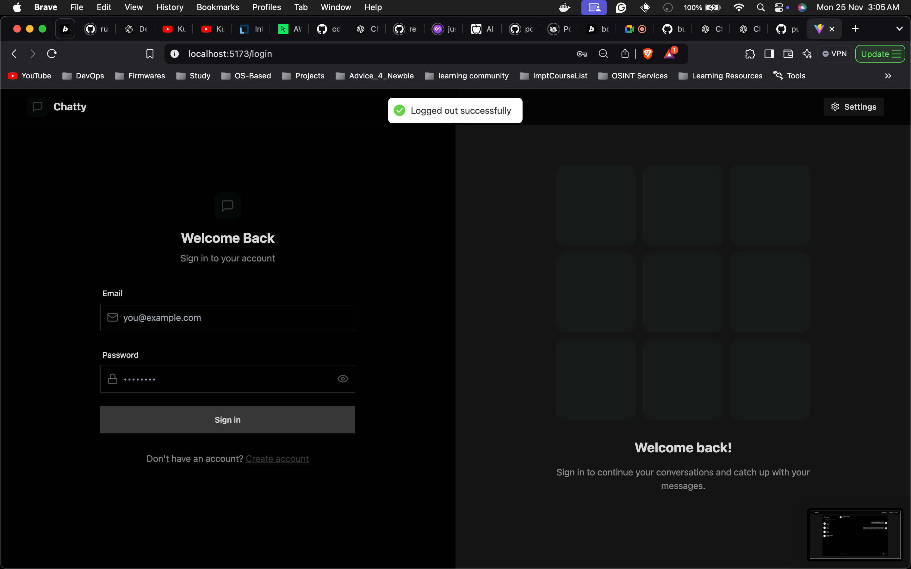
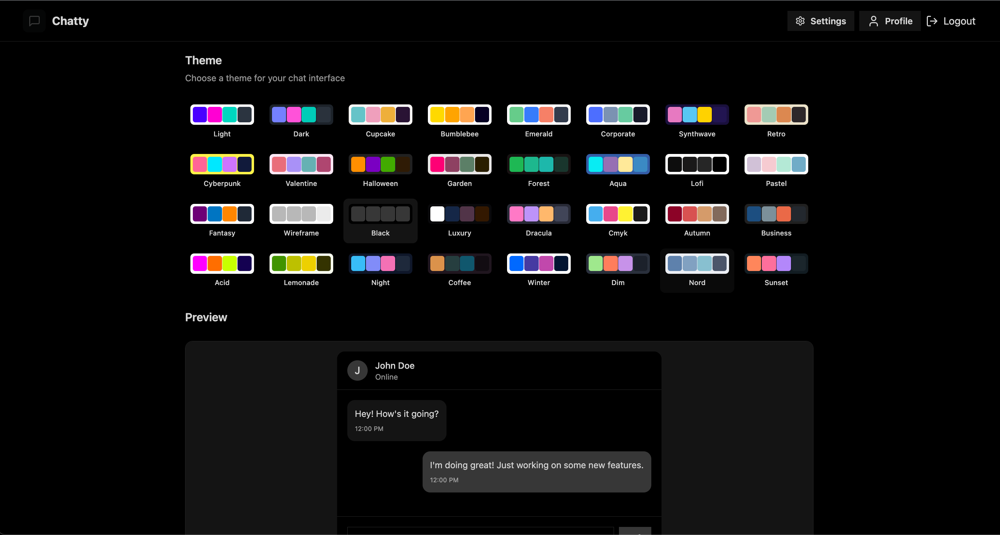

# Full-Stack Chat Application | Kubernetes (Minikube + Ingress)

This repository contains a **Full-Stack Chat Application** that is containerized using **Docker** and deployed locally on a **Kubernetes cluster using Minikube**.  
The application is exposed using an **NGINX Ingress Controller**, providing a production-like routing setup.

This project demonstrates hands-on **DevOps practices** including Docker image creation, Kubernetes deployments, services, and ingress-based traffic management.

---

## 🚀 Tech Stack

- Frontend: React
- Backend: Node.js + Express
- Containerization: Docker
- Orchestration: Kubernetes
- Local Cluster: Minikube
- Ingress Controller: NGINX Ingress
- Tools: kubectl, Git, GitHub
- OS: Windows (Docker Desktop)

---

## 🗂️ Project Structure

full-stack_chatApp/
├── backend/
│ ├── Dockerfile
│ ├── server.js
│ ├── package.json
│
├── frontend/
│ ├── Dockerfile
│ ├── src/
│ ├── package.json
│
├── k8s/
│ ├── backend-deployment.yaml
│ ├── backend-service.yaml
│ ├── frontend-deployment.yaml
│ ├── frontend-service.yaml
│ └── ingress.yaml
│
├── .gitignore
└── README.md

yaml
Copy code

---

## 📸 Screenshots

### 💬 Chat Interface


### 🔐 Login Page


### 📊 Setting


## 📋 Prerequisites

Ensure the following tools are installed:

- Docker Desktop
- Minikube
- kubectl
- Git

Verify installations:

```bash
docker --version
minikube version
kubectl version --client
⚙️ Run the Project Locally (Step-by-Step)
1️⃣ Clone the Repository
git clone https://github.com/onkar-1817/full-stack_chatApp.git
cd full-stack_chatApp
2️⃣ Start Minikube
minikube start
3️⃣ Enable NGINX Ingress Controller
minikube addons enable ingress
Verify ingress controller:
kubectl get pods -n ingress-nginx
4️⃣ Use Minikube Docker Environment
eval $(minikube docker-env)
5️⃣ Build Docker Images
docker build -t chatapp-backend:latest ./backend
docker build -t chatapp-frontend:latest ./frontend
6️⃣ Deploy Application to Kubernetes
kubectl apply -f k8s/
7️⃣ Verify Deployments & Services
kubectl get pods
kubectl get services
kubectl get ingress
Ensure all resources are in Running state.

8️⃣ Access the Application via Ingress
Get Minikube IP:

minikube ip
Add entry to hosts file:


<MINIKUBE_IP> chatapp.local
Access the app in browser:

http://chatapp.local
